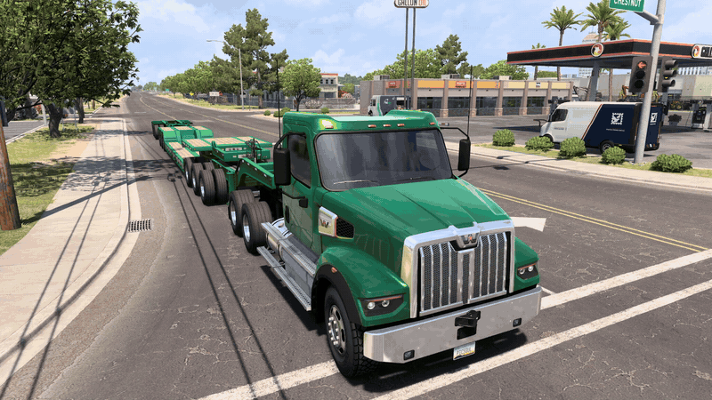

# Dynamic Banners-N-Flags

A plugin for **American Truck Simulator** and **Euro Truck Simulator 2** that shows your **oversize banners and
warning flags only while your beacons are on**. It works on your own truck and on every trailer hooked up to it.



*Recorded with the optional beacon units setting (`HideBeacons = 1`) turned on.*

- Turn the beacons **on** and your banners and flags appear. Turn them **off** and they disappear.
- **Optional:** set `HideBeacons = 1` to make the beacon units themselves (roof and chassis beacons, trailer beacon
  bars and strobe bars) appear and disappear too. Only accessories whose 3D model actually carries beacon lights
  are toggled, so bumpers, doors and rear frames never disappear.
- Only **your own** truck and trailers are affected, never AI traffic or other players in multiplayer.
- The same DLL works in both games. It detects which game loaded it and uses that game's defaults.

**Download:** see [Releases](../../releases). The zip contains the DLL and a `README.txt` with install steps.

## What toggles in each game

| | American Truck Simulator | Euro Truck Simulator 2 |
|---|---|---|
| Banners and flags (`Slots`) | truck `f_banner`, `flag_f_l`, `flag_f_r`; trailer `r_banner`, `flag_r_l`, `flag_r_r` | trailer `r_banner` (wide/long vehicle, TIR plates) |
| Beacon units (`BeaconSlots`, only with `HideBeacons = 1`) | `beacon`, `chs_beacon`, `rear_body` | `beacon`, `chs_beacon`, `rear_body` |

ETS2 trucks have no oversize banners or warning flags. Their `flag_l` / `flag_r` slots hold national flags, which
keep showing unless you add them to `Slots`. Modded trucks and trailers work too if they use the same slot names;
otherwise add their slot names in the ini.

## Install

1. Copy `dynamic_banners.dll` into the game's `bin\win_x64\plugins\` folder (create `plugins` if it doesn't exist):
   - `...\steamapps\common\American Truck Simulator\bin\win_x64\plugins\`
   - `...\steamapps\common\Euro Truck Simulator 2\bin\win_x64\plugins\`

   In Steam: right-click the game > Manage > Browse local files > `bin` > `win_x64`. Put a copy in both games if
   you play both.
2. Start the game and accept the "SDK plugins" prompt.
3. Open the console (`~`). You should see `[Dynamic Banners] v1.3.0 active ...`.

To uninstall, delete `dynamic_banners.dll` (and `dynamic_banners.ini` / `.log`) from the `plugins` folder.

## Where the toggle applies

| Scene | Banners and flags (and beacon units, if enabled) |
|---|---|
| Driving, photo mode | Follow the beacons |
| Pause menu, service center | Always shown |

The pause menu and service center draw their own copy of the truck. The plugin deliberately leaves that copy
alone: reaching it would mean depending on more of the game's internal UI code, which makes the plugin more likely
to break on game updates.

## Configuration (`dynamic_banners.ini`, optional)

The plugin writes this file next to itself on first start, with that game's defaults. Delete it to go back to the
defaults.

| Key | Default | Meaning |
|---|---|---|
| `Enabled` | 1 | Turns the plugin on or off |
| `LogLevel` | 0 | 0 = no log file. For troubleshooting: 1 = errors only … 4 = debug (logs to `dynamic_banners.log`) |
| `InvertBeacon` | 0 | 1 = hide while the beacons are ON instead |
| `AffectTrailers` | 1 | Also toggle trailers hooked up to your truck |
| `UseClothHook` | 1 | Hide flag cloth with a small draw hook (0 = no code hooks at all, but then flag cloth has to be shown while paused) |
| `Slots` | per game, see above | Accessory slot names to toggle |
| `HideBeacons` | 0 | 1 = also toggle beacon units (roof/chassis beacons, trailer beacon and strobe bars) |
| `BeaconSlots` | `beacon, chs_beacon, rear_body` | Slots checked for beacon units (an accessory there is toggled only if its model has beacon lights) |

## How it works

The plugin loads through the games' official telemetry SDK and reads the beacon state from the
`truck.light.beacon` channel. Once per frame, on the game thread, it follows the game's own local-player pointer to
your truck and to each **hooked-up** trailer, and then:

| What | How it is hidden |
|---|---|
| Banners and the static part of flags | The accessory's visibility mask is set to 0 (a data write) |
| Truck accessories baked into the merged truck model | The truck's merged model is switched off while hidden (a data write) |
| Flag cloth (physics simulated) | One small hook on the cloth draw function skips your hidden flags. The cloth keeps simulating, so it waves naturally when shown again. |
| Beacon units (`HideBeacons = 1`) | Same visibility mask as banners. An accessory counts as a beacon unit when its model has a light the game classifies as a beacon (class `flare_vehicle`, `light_type` beacon), read from the game's own reflection data by name. |

Everything is undone exactly when the banners should be shown again. Every game-memory access is exception-guarded.

All game addresses and offsets are found at startup from code signatures (identical in both games), never
hard-coded. If a required signature doesn't match (for example after a game update), the plugin does nothing and
prints `[Dynamic Banners] INACTIVE` in the console. It never guesses.

## Building

Requirements: Visual Studio 2022 (x64 C++ tools). For the tools and tests: Python 3 (standard library only).

```cmd
git clone --recursive https://github.com/PicSoul/dynamic-banners-n-flags
build.bat               :: bin\dynamic_banners.dll
tests\run_tests.bat     :: unit tests + signature check against every installed game
install.bat             :: copies the DLL into every installed game (ATS and/or ETS2), found through Steam
package.bat             :: dist\Dynamic-Banners-N-Flags-v<version>.zip for a release
```

The version lives in `include\version.h`.

## After a game update

1. Run **`tools\update_check.bat`**. It finds ATS and ETS2 through Steam, reads the signatures built into each
   game's installed `dynamic_banners.dll`, and checks them against that game's new executable.
2. If something is reported as BROKEN, run **`tools\update_check.bat --write`**. It searches the new executable for
   the moved code and writes repaired signatures into that game's `dynamic_banners.ini`, stamped with the game
   build they're for (a backup is kept). No recompiling is needed.

   Overrides only apply to that exact game build, so an old ini can never break a newer DLL. To make a repair
   permanent, copy the repaired signatures into `src\config_manager.cpp`, bump the version, and release.
3. If it reports **NEEDS MANUAL WORK**, the game's code changed shape and the signature has to be re-derived by
   hand. Please open an issue.

## Multiplayer

- **SCS Convoy** (built-in multiplayer): only the local player's truck and trailers are changed, and only on your
  own screen.
- **TruckersMP**: TruckersMP has its own rules about client modifications and may treat memory-modifying plugins as
  a violation. **Use it there at your own risk.**

## Planned

- **Other players in SCS Convoy**: see a friend's banners, flags and beacon units follow *their* beacons, when both
  of you run the plugin. Players without the plugin keep looking normal. The plugins recognise each other through
  a tag in the Convoy session's Steam lobby. TruckersMP support may follow after that. Tracked in
  [the issues](../../issues).

## License

MIT, see [LICENSE](LICENSE). Includes [MinHook](https://github.com/TsudaKageyu/minhook) (BSD 2-Clause) and the SCS
SDK telemetry headers (MIT-style), see [THIRD_PARTY_NOTICES.md](THIRD_PARTY_NOTICES.md).
